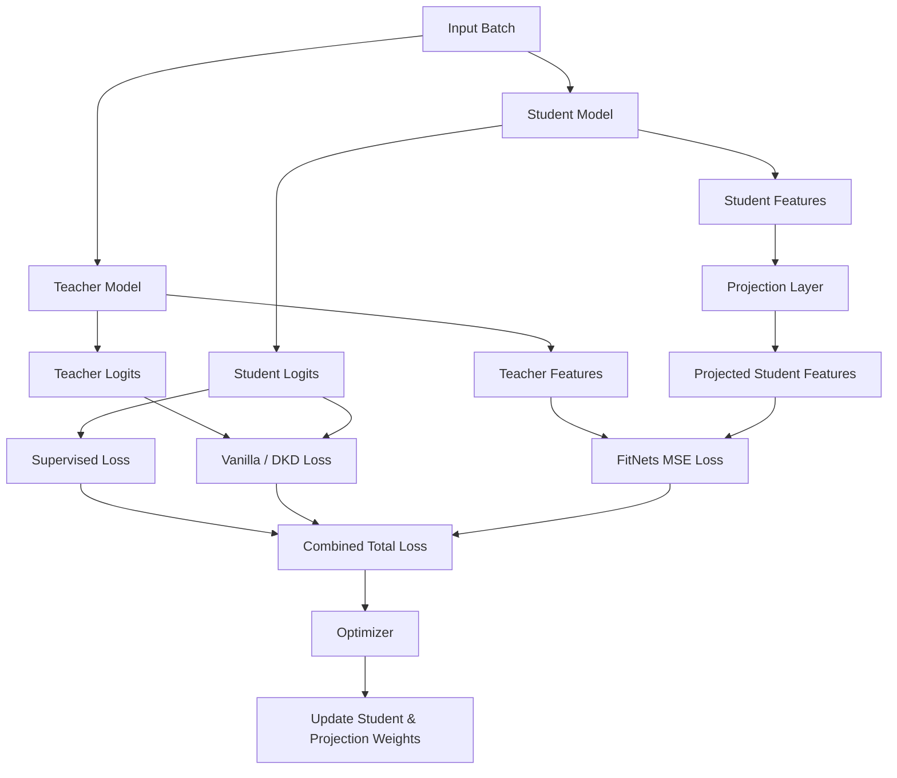

# Knowledge Distillation in Keras

[](https://www.python.org/downloads/)
[](https://tensorflow.org)
[](https://opensource.org/licenses/MIT)
[](https://github.com)

A professional, production-ready library demonstrating **Knowledge Distillation** (KD) for deep neural networks using TensorFlow and Keras. This repository provides modular, SOLID-compliant implementations to compress large models (teachers) into smaller, faster models (students) without significant loss in predictive performance.

---

## 🚀 Key Features

This repository extends classical response-based distillation with state-of-the-art compression techniques:

*   **Vanilla Logits Distillation**: Classic Kullback-Leibler (KL) divergence matching between softened student and teacher output logits.
*   **Decoupled Knowledge Distillation (DKD)**: Implementation of the CVPR 2022 paper that decouples classical KD into *Target Class Knowledge Distillation (TCKD)* and *Non-Target Class Knowledge Distillation (NCKD)* for enhanced student learning.
*   **Feature-based Distillation (FitNets)**: Matches intermediate activations/feature maps (hints) from the teacher with those of the student.
*   **Dynamic Alignment Projections**: Automatically inserts trainable 1x1 Convolutional or Dense projection layers and resizes spatial outputs if student and teacher intermediate feature shapes differ.
*   **Hybrid Distillation**: Jointly optimizes supervised ground-truth, logits-based distillation, and feature-based hint matching.

---

## 🧠 Architecture Overview

The following diagram illustrates how the `Distiller` training loop computes and combines the target, logits, and feature losses to optimize the student weights and dynamic projection layers:



### File Structure

```text
.
├── src/                # Core modular Python package
│   ├── data.py         # Data loading and preprocessing pipelines
│   ├── models.py       # Teacher and Student network templates
│   ├── losses.py       # Modernized KL and Decoupled KD loss functions
│   └── trainer.py      # Flexible Distiller model supporting hybrid KD modes
├── examples/           # Execution scripts
│   ├── train_mnist.py           # Standard KD walkthrough
│   └── train_mnist_advanced.py  # Advanced KD walkthrough (DKD, Feature, Hybrid)
├── notebooks/          # Exploratory Jupyter Notebooks
└── tests/              # Pytest-based unit test suite
```

---

## 💻 Installation

Ensure you have Python 3.9+ installed. It is recommended to use a virtual environment.

```bash
# Clone the repository
git clone https://github.com/yourusername/Knowledge-Distillation-in-Keras.git
cd Knowledge-Distillation-in-Keras

# Install package and requirements
pip install -r requirements.txt
pip install -e .
```

---

## 🛠️ Usage

### Running Examples

To execute the standard MNIST training pipeline:
```bash
python examples/train_mnist.py
```

To run the advanced multi-method benchmarking suite (Vanilla, DKD, Feature, Hybrid):
```bash
python examples/train_mnist_advanced.py
```

### Integrating the Distiller

You can configure the `Distiller` to run in any mode by defining the layers to extract and the distillation type:

```python
import tensorflow as tf
from src.trainer import Distiller
from src.models import get_teacher_model, get_student_model

# 1. Instantiate student and pre-trained teacher
teacher = get_teacher_model()
student = get_student_model()

# 2. Configure a Hybrid Distiller (Logits + Feature-based)
distiller = Distiller(
    student=student,
    teacher=teacher,
    temperature=3.0,
    distillation_type="hybrid",
    student_hint_layers=["student_dense_layer"],
    teacher_guided_layers=["teacher_dense_layer"]
)

# 3. Compile with learning objectives
distiller.compile(
    optimizer=tf.keras.optimizers.Adam(learning_rate=1e-3),
    metrics=[tf.keras.metrics.SparseCategoricalAccuracy()],
    student_loss_fn=tf.keras.losses.SparseCategoricalCrossentropy(from_logits=True),
    alpha=0.1,  # Supervised loss weight
    gamma=1.0   # Feature loss weight
)

# 4. Train Student Model
distiller.fit(train_ds, epochs=10, validation_data=test_ds)
```

---

## 🧪 Running Tests

To verify that loss functions, shape projection layers, and training loops operate correctly under all modes, run the automated test suite:

```bash
python -m pytest tests/
```

---

## 🤝 Contributing

We welcome contributions! Please see our [CONTRIBUTING.md](CONTRIBUTING.md) for guidelines on code formatting, standards, and submission.

## 📝 License

This project is licensed under the MIT License - see the LICENSE file for details.

